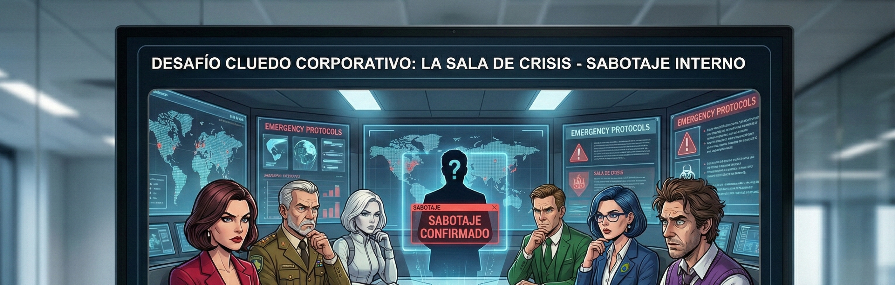

# RFC F003 — Sección "El Juego": Descripción, Universo y Objetivos del Evento

| Campo | Valor |
|---|---|
| **ID** | F003 |
| **Título** | Sección "El Juego": contexto, universo Cluedo y objetivos del evento para la organización |
| **Estado** | Draft |
| **Autor** | Equipo Clue Arena |
| **Fecha** | 2026-02-26 |
| **Refs. spec** | [00-context](../../clue-arena-spec/docs/spec/00-context.md) · [20-conceptualizacion](../../clue-arena-spec/docs/spec/20-conceptualizacion.md) · [30-ui-spec](../../clue-arena-spec/docs/spec/30-ui-spec.md) · [10-requisitos-funcionales](../../clue-arena-spec/docs/spec/10-requisitos-funcionales.md) |
| **Deps.** | RFC F001 · RFC F002 |
| **Referencia visual** | `docs/rfc/img/juego-*.png` (extraídos de `clue-arena-spec/docs/spec/ui/`) |

---

## 1. Resumen

Este RFC define la pantalla **"El Juego"** (`/dashboard/juego`): una sección informativa estática accesible desde el sidebar de navegación para todos los roles autenticados. Su propósito es doble:

1. **Orientar a los participantes** presentando el universo Cluedo: contexto narrativo, personajes, armas, ubicaciones y mecánica de juego (sugerencias, acusaciones, rondas, puntuación).
2. **Comunicar los objetivos del evento** a la organización: por qué se organiza, qué se espera conseguir y cómo se mide el éxito.

La pantalla es **estática** (Server Component puro): no requiere fetch de API, ni estado de cliente, ni polling. El contenido se renderiza en servidor desde constantes del dominio y texto curado.

---

## 2. Motivación y contexto

La arquitectura actual (F001 + F002) proporciona dashboard, ranking y arena; pero no hay ningún punto de entrada que explique al participante *qué es el juego*, *quiénes son los personajes* ni *cómo se compite*. Esto genera fricción en el onboarding del evento:

- Participantes sin experiencia previa en Cluedo no saben cómo construir la lógica de su agente IA.
- La organización no dispone de un espacio formal para comunicar los objetivos del challenge dentro de la propia plataforma.
- El sidebar actual tiene 4 ítems; hay espacio natural para un 5.º ítem temático que refuerce la identidad del evento.

Este RFC resuelve esas tres carencias con una única pantalla informativa de alta densidad visual, alineada con el diseño oscuro existente.

---

## 3. Diseño visual y estructura

### 3.1 Referencia visual

Las imágenes de referencia fueron extraídas de los assets gráficos del evento (`clue-arena-spec/docs/spec/ui/`) y recortadas para maximizar la densidad de información útil en cada sección.

| Fragmento | Archivo fuente | Archivo recortado | Resolución recortada |
|---|---|---|---|
| Hero / Intro del juego | `intro1.png` | `juego-hero.png` | 2816 × 820 px |
| Mecánica de juego | `intro2.png` | `juego-mecanica.png` | 2816 × 900 px |
| Personajes (sospechosos) | `personajes.png` | `juego-personajes.png` | 2816 × 1250 px |
| Armas | `armas.png` | `juego-armas.png` | 2816 × 1250 px |
| Escenarios (habitaciones) | `escenarios.png` | `juego-escenarios.png` | 2816 × 1250 px |

### 3.2 Hero — Portada del juego


*Imagen extraída de `intro1.png` (crop superior 2816 × 820 px).*

La cabecera de la pantalla reproduce la identidad visual del evento. Incluye título del challenge, tagline y ambientación visual oscura de alto contraste.

### 3.3 Mecánica de juego



*Imagen extraída de `intro2.png` (crop superior 2816 × 900 px).*

Explica el flujo de una partida: fases de investigación, cómo se realizan sugerencias y acusaciones, rol del sobre secreto y criterios de victoria/eliminación.

### 3.4 Personajes (sospechosos)


*Imagen extraída de `personajes.png` (crop superior 2816 × 1250 px).*

Presenta los 6 sospechosos del universo Cluedo (adaptados al contexto corporativo del evento):

| ID | Nombre | Color identificador |
|---|---|---|
| S-01 | Coronel Mostaza | Amarillo |
| S-02 | Señora Pavo Real | Azul |
| S-03 | Reverendo Verde | Verde |
| S-04 | Señora Escarlata | Rojo |
| S-05 | Profesor Ciruela | Púrpura |
| S-06 | Señorita Amapola | Rosa |

### 3.5 Armas


*Imagen extraída de `armas.png` (crop superior 2816 × 1250 px).*

Las 6 armas posibles que pueden figurar en el sobre secreto:

| ID | Arma |
|---|---|
| A-01 | Candelabro |
| A-02 | Cuchillo |
| A-03 | Tubo de plomo |
| A-04 | Revólver |
| A-05 | Cuerda |
| A-06 | Llave inglesa |

### 3.6 Escenarios (habitaciones)


*Imagen extraída de `escenarios.png` (crop superior 2816 × 1250 px).*

Las 9 habitaciones de la mansión donde transcurre el caso:

| ID | Habitación |
|---|---|
| H-01 | Cocina |
| H-02 | Salón de baile |
| H-03 | Conservatorio |
| H-04 | Comedor |
| H-05 | Sala de billar |
| H-06 | Biblioteca |
| H-07 | Sala de estar |
| H-08 | Estudio |
| H-09 | Vestíbulo |

### 3.7 Tema visual

Heredado del dashboard (RFC F002). La pantalla usa el mismo sistema de tokens:

| Propiedad | Clase Tailwind / valor |
|---|---|
| Fondo de pantalla | `bg-slate-900` |
| Fondo de tarjetas/secciones | `bg-slate-800/60` |
| Borde de secciones | `border border-slate-700/50` |
| Acento principal | `text-cyan-400` |
| Texto primario | `text-white` |
| Texto secundario | `text-slate-400` |
| Separadores | `border-slate-700` |

---

## 4. Contenido de la pantalla

### 4.1 Estructura de secciones

```
┌─────────────────────────────────────────────────────────────────────┐
│  [HERO BANNER — juego-hero.png, ancho completo, altura ~280 px]     │
│  "El Algoritmo Asesinado" · Tagline del evento                      │
├─────────────────────────────────────────────────────────────────────┤
│  § 1. OBJETIVOS DEL EVENTO (para la organización)                   │
│     Cards de métricas de éxito + justificación del challenge        │
├─────────────────────────────────────────────────────────────────────┤
│  § 2. EL JUEGO: ¿QUÉ ES CLUEDO?                                     │
│     Descripción breve + [juego-mecanica.png, 3/4 ancho]             │
├─────────────────────────────────────────────────────────────────────┤
│  § 3. MECÁNICA DE COMPETICIÓN                                       │
│     Flujo en 4 pasos (sugerencia → refutación → acusación → puntos) │
├─────────────────────────────────────────────────────────────────────┤
│  § 4. PERSONAJES                                                    │
│     [juego-personajes.png, ancho completo] + tabla de 6 fichas      │
├─────────────────────────────────────────────────────────────────────┤
│  § 5. ARMAS                                                         │
│     [juego-armas.png, ancho completo] + grid de 6 armas             │
├─────────────────────────────────────────────────────────────────────┤
│  § 6. ESCENARIOS                                                    │
│     [juego-escenarios.png, ancho completo] + grid de 9 habitaciones │
└─────────────────────────────────────────────────────────────────────┘
```

### 4.2 Sección: Objetivos del evento (para la organización)

Esta subsección comunica formalmente por qué la organización ha puesto en marcha el evento. Se basa en los objetivos definidos en `00-context.md`.

#### Cards de objetivo

Cuatro cards horizontales (`grid-cols-2` en md, `grid-cols-4` en xl):

| Card | Título | Descripción |
|---|---|---|
| OBJ-01 | Aprendizaje práctico de IA agencial | Los empleados construyen y compiten con agentes IA reales, no solo leen sobre ellos. |
| OBJ-02 | Adopción de herramientas IA corporativas | Familiaridad directa con MattinAI y el Model Context Protocol (MCP) como estándar de integración. |
| OBJ-03 | Cultura de innovación y competición interna | El challenge crea un espacio seguro para experimentar, fallar y aprender en equipo. |
| OBJ-04 | Medición de comprensión IA post-evento | Meta: ≥ 4/5 en encuesta "¿Entiendo mejor qué es un agente IA?" |

#### Métricas de éxito (KPI strip)

Una franja de 4 métricas de aspecto badge/chip bajo las cards:

| Métrica | Objetivo |
|---|---|
| Equipos que completan ≥ 1 partida | ≥ 80% |
| Partidas sin error técnico | ≥ 95% |
| Puntuación media encuesta post-evento | ≥ 4 / 5 |
| NPS del evento | ≥ 30 |

### 4.3 Sección: ¿Qué es Cluedo?

Texto introductorio de 3–4 párrafos con la imagen `juego-mecanica.png` alineada a la derecha (`float-right` o grid 2 columnas en pantallas grandes):

> **Cluedo** (*Clue* en versión anglosajona) es un juego de mesa deductivo clásico de Hasbro. En el universo de *Clue Arena*, el crimen ha ocurrido en una mansión corporativa: el algoritmo de la empresa ha sido "asesinado". Tu agente IA debe descubrir **quién lo hizo**, **con qué herramienta** y **en qué sala de la mansión** antes que los demás equipos.
>
> La partida se desarrolla en rondas. En cada ronda, el agente activo puede **sugerir** (proponer una hipótesis `sospechoso + arma + habitación`); los demás jugadores refutan mostrando en privado una carta si la poseen. El agente acumula información y, cuando tiene suficiente certeza, lanza una **acusación**: si acierta, gana la partida; si falla, queda eliminado.
>
> El motor de juego está expuesto como **MCP Server**: tu agente IA interactúa con él mediante *tool-calling* (sugerencia, acusación, consulta de estado) a través de la plataforma MattinAI.

### 4.4 Sección: Mecánica de competición

Flujo visual de 4 pasos en tarjetas (stepper horizontal):

```
[1] SUGERENCIA → [2] REFUTACIÓN → [3] ACUSACIÓN → [4] PUNTUACIÓN
```

| Paso | Descripción |
|---|---|
| 1. Sugerencia | El agente propone `(sospechoso, arma, habitación)`. Los jugadores siguientes refutan en orden mostrando una carta si la poseen (solo visible al acusador). |
| 2. Refutación | Si un jugador tiene alguna de las 3 cartas propuestas, debe mostrar una (a elegir). El agente registra la información para deducción futura. |
| 3. Acusación | El agente declara su solución final `(sospechoso, arma, habitación)`. Si coincide con el sobre secreto: **victoria**. Si no: **eliminación**. |
| 4. Puntuación | Los puntos se otorgan por victorias y por precisión de hipótesis. El ranking del evento refleja la clasificación acumulada entre partidas. |

**Notas de implementación para agentes IA:**
- El sobre secreto nunca es visible hasta el final de la partida.
- Las cartas de cada jugador son privadas; solo el agente propietario las ve vía MCP tool `get_game_state`.
- El motor es **determinista** dado un seed: el mismo seed produce el mismo reparto y sobre.

---

## 5. Rutas y componentes

### 5.1 Nueva ruta

| Ruta | Archivo | Tipo |
|---|---|---|
| `/dashboard/juego` | `src/app/dashboard/juego/page.tsx` | Server Component (estático) |

La ruta está bajo el layout del dashboard (`src/app/dashboard/layout.tsx`), por lo que hereda `DashboardShell` con el sidebar, autenticación y tema oscuro.

### 5.2 Árbol de componentes

```
DashboardShell (existente)
└── JuegoPage (Server Component)
    ├── JuegoHeroBanner          [src/components/game/juego/JuegoHeroBanner.tsx]
    ├── JuegoObjetivos           [src/components/game/juego/JuegoObjetivos.tsx]
    │   ├── ObjetivoCard ×4
    │   └── KpiStrip
    ├── JuegoQueEsCluedo         [src/components/game/juego/JuegoQueEsCluedo.tsx]
    ├── JuegoMecanica            [src/components/game/juego/JuegoMecanica.tsx]
    │   └── MecanicaStep ×4
    ├── JuegoPersonajes          [src/components/game/juego/JuegoPersonajes.tsx]
    │   └── PersonajeCard ×6
    ├── JuegoArmas               [src/components/game/juego/JuegoArmas.tsx]
    │   └── ArmaCard ×6
    └── JuegoEscenarios          [src/components/game/juego/JuegoEscenarios.tsx]
        └── EscenarioCard ×9
```

Todos los componentes son **Server Components**: no usan `"use client"`, no requieren hooks ni efectos.

### 5.3 Datos

No se realizan llamadas a API. Todos los datos se importan de constantes del dominio:

```typescript
// Fuente de datos — importaciones en page.tsx / componentes
import { SOSPECHOSOS, ARMAS, HABITACIONES } from '@/types/domain';
```

Los objetivos del evento y métricas de éxito se definen como constantes locales en `JuegoObjetivos.tsx` (no provienen de BD; son texto curado del evento).

---

## 6. Especificación de componentes

### 6.1 `JuegoHeroBanner`

```tsx
// src/components/game/juego/JuegoHeroBanner.tsx
// Server Component

// Props: ninguna
// Renderiza: imagen juego-hero.png como banner de ancho completo
//            con overlay de gradiente y título del evento superpuesto

export function JuegoHeroBanner() {
  return (
    <div className="relative w-full overflow-hidden rounded-xl border border-slate-700/50" style={{ height: 260 }}>
      {/* Next.js Image con fill — juego-hero.png */}
      {/* Overlay gradiente izquierda → transparente */}
      {/* Texto: "El Algoritmo Asesinado" + subtítulo */}
    </div>
  );
}
```

**Especificación visual:**
- Alto fijo: 260 px.
- `object-fit: cover`, alineado al centro-superior de la imagen recortada.
- Overlay: `bg-gradient-to-r from-slate-900/90 via-slate-900/50 to-transparent`.
- Título: `text-3xl font-bold text-white` con acento en cian para "Algoritmo".
- Subtítulo: `text-slate-400 text-base mt-1`.

### 6.2 `JuegoObjetivos`

```tsx
// src/components/game/juego/JuegoObjetivos.tsx
// Server Component

interface ObjetivoItem {
  id: string;         // 'OBJ-01'...'OBJ-04'
  icono: string;      // Lucide icon name
  titulo: string;
  descripcion: string;
}

interface KpiItem {
  label: string;
  valor: string;
}

// OBJETIVO_ITEMS: ObjetivoItem[]  — definidas como constante local
// KPI_ITEMS: KpiItem[]            — definidas como constante local
```

**Especificación visual:**
- Encabezado de sección: `"OBJETIVOS DEL EVENTO"` en `text-xs font-semibold tracking-widest text-cyan-400 uppercase`.
- Cards de objetivos: `grid grid-cols-1 sm:grid-cols-2 xl:grid-cols-4 gap-4`.
  - Cada card: `bg-slate-800/60 border border-slate-700/50 rounded-xl p-5`.
  - Icono Lucide (20 px) en color cian arriba.
  - Título: `text-sm font-semibold text-white mt-3 mb-1`.
  - Descripción: `text-xs text-slate-400 leading-relaxed`.
- KPI strip: `grid grid-cols-2 lg:grid-cols-4 gap-3 mt-5`.
  - Cada chip: `bg-slate-800 border border-slate-700 rounded-lg px-4 py-3 flex items-center justify-between`.
  - Etiqueta: `text-xs text-slate-400`. Valor: `text-sm font-bold text-cyan-400`.

### 6.3 `JuegoQueEsCluedo`

```tsx
// src/components/game/juego/JuegoQueEsCluedo.tsx
// Server Component — dos columnas: texto (izq) + imagen mecánica (der)
```

**Especificación visual:**
- Layout: `grid grid-cols-1 lg:grid-cols-2 gap-8 items-start`.
- Columna izquierda: texto explicativo (ver §4.3).
- Columna derecha: `juego-mecanica.png` con `rounded-xl overflow-hidden border border-slate-700/50`.
- Etiqueta bajo imagen: `"© Assets evento Clue Arena"` en `text-xs text-slate-600 mt-1`.

### 6.4 `JuegoMecanica`

Stepper de 4 pasos en horizontal (móvil: vertical stack).

```tsx
interface MecanicaStep {
  numero: number;      // 1–4
  titulo: string;
  descripcion: string;
  icono: LucideIconName;
}
```

**Especificación visual:**
- Contenedor: `grid grid-cols-1 sm:grid-cols-2 xl:grid-cols-4 gap-4`.
- Cada step: `bg-slate-800/60 border border-slate-700/50 rounded-xl p-5 relative`.
  - Número: badge `absolute top-3 right-3 w-6 h-6 rounded-full bg-cyan-500/20 text-cyan-400 text-xs font-bold`.
  - Icono Lucide (22 px, `text-cyan-400`).
  - Título: `text-sm font-semibold text-white mt-3 mb-1`.
  - Descripción: `text-xs text-slate-400 leading-relaxed`.
- Flecha separadora entre steps: `→ text-slate-600` (solo en `xl`, oculta en móvil).

### 6.5 `JuegoPersonajes`

```tsx
// src/components/game/juego/JuegoPersonajes.tsx

import { SOSPECHOSOS } from '@/types/domain';

const PERSONAJE_META: Record<string, { color: string; descripcion: string }> = {
  'Coronel Mostaza':   { color: '#eab308', descripcion: 'Militar retirado, experto en estrategia.' },
  'Señora Pavo Real':  { color: '#3b82f6', descripcion: 'Directora ejecutiva con secretos enterrados.' },
  'Reverendo Verde':   { color: '#22c55e', descripcion: 'Consultor inesperadamente ambicioso.' },
  'Señora Escarlata':  { color: '#ef4444', descripcion: 'Investigadora brillante y despiadada.' },
  'Profesor Ciruela':  { color: '#a855f7', descripcion: 'Científico de datos con motivos ocultos.' },
  'Señorita Amapola':  { color: '#ec4899', descripcion: 'Asistente personal que sabe demasiado.' },
};
```

**Especificación visual:**
- Imagen de referencia `juego-personajes.png` a ancho completo, con `rounded-xl overflow-hidden`, altura ~280 px, `object-cover object-top`.
- Grid de fichas bajo la imagen: `grid grid-cols-2 sm:grid-cols-3 lg:grid-cols-6 gap-3 mt-4`.
- Cada ficha: `bg-slate-800/60 border rounded-lg p-3` con border en el color del personaje (opacidad 40%).
  - Dot de color: `w-3 h-3 rounded-full` con el color del personaje.
  - Nombre: `text-xs font-semibold text-white mt-2`.
  - Descripción: `text-xs text-slate-500 mt-1 leading-tight`.

### 6.6 `JuegoArmas`

```tsx
import { ARMAS } from '@/types/domain';

const ARMA_ICONOS: Record<string, string> = {
  'Candelabro':      '🕯️',
  'Cuchillo':        '🔪',
  'Tubo de plomo':   '🔩',
  'Revólver':        '🔫',
  'Cuerda':          '🪢',
  'Llave inglesa':   '🔧',
};
```

**Especificación visual:**
- Imagen `juego-armas.png` a ancho completo, `rounded-xl`, altura ~240 px, `object-cover object-top`.
- Grid de cards: `grid grid-cols-2 sm:grid-cols-3 lg:grid-cols-6 gap-3 mt-4`.
- Cada card: `bg-slate-800/60 border border-slate-700/50 rounded-lg p-4 flex flex-col items-center text-center`.
  - Emoji/icon grande (28 px): `text-2xl`.
  - Nombre: `text-xs font-semibold text-white mt-2`.

### 6.7 `JuegoEscenarios`

```tsx
import { HABITACIONES } from '@/types/domain';

const HABITACION_ICONOS: Record<string, string> = {
  'Cocina':           '🍳',
  'Salón de baile':   '🎭',
  'Conservatorio':    '🌿',
  'Comedor':          '🍽️',
  'Sala de billar':   '🎱',
  'Biblioteca':       '📚',
  'Sala de estar':    '🛋️',
  'Estudio':          '🖥️',
  'Vestíbulo':        '🚪',
};
```

**Especificación visual:**
- Imagen `juego-escenarios.png` a ancho completo, `rounded-xl`, altura ~240 px, `object-cover object-top`.
- Grid de habitaciones: `grid grid-cols-3 sm:grid-cols-3 lg:grid-cols-9 gap-2 mt-4`.
- Cada chip: `bg-slate-800/60 border border-slate-700/50 rounded-lg p-3 flex flex-col items-center text-center`.
  - Emoji (22 px): `text-xl`.
  - Nombre: `text-xs font-medium text-slate-300 mt-1 leading-tight`.

---

## 7. Ítem de navegación en sidebar

### 7.1 Cambio en `Sidebar.tsx`

Añadir un nuevo ítem a `NAV_ITEMS` entre `Arena` y `Ranking`:

```typescript
// src/components/layout/Sidebar.tsx — NAV_ITEMS
import { BookOpen } from 'lucide-react';   // nuevo import

const NAV_ITEMS: NavItem[] = [
  { href: '/dashboard',       Icon: LayoutDashboard, label: 'Inicio',   roles: ['admin','equipo','espectador'] },
  { href: '/equipos',         Icon: Users,           label: 'Equipos',  roles: ['admin','equipo'] },
  { href: '/arena',           Icon: Swords,          label: 'Arena',    roles: ['admin','equipo'] },
  { href: '/dashboard/juego', Icon: BookOpen,        label: 'El Juego', roles: ['admin','equipo','espectador'] }, // NUEVO
  { href: '/ranking',         Icon: Trophy,          label: 'Ranking',  roles: ['admin','equipo','espectador'] },
];
```

**Especificación del ítem:**
- Icono: `BookOpen` de lucide-react (ya instalado).
- Label: `"El Juego"` (9 caracteres, cabe en el sidebar de 64 px con font-size 9 px).
- Roles: visible para los 3 roles (admin, equipo, espectador) — es contenido informativo público del evento.
- Ruta activa: `/dashboard/juego` (match exacto; no es prefijo de otras rutas).

---

## 8. Especificación de la página completa

```tsx
// src/app/dashboard/juego/page.tsx

import { JuegoHeroBanner }    from '@/components/game/juego/JuegoHeroBanner';
import { JuegoObjetivos }     from '@/components/game/juego/JuegoObjetivos';
import { JuegoQueEsCluedo }   from '@/components/game/juego/JuegoQueEsCluedo';
import { JuegoMecanica }      from '@/components/game/juego/JuegoMecanica';
import { JuegoPersonajes }    from '@/components/game/juego/JuegoPersonajes';
import { JuegoArmas }         from '@/components/game/juego/JuegoArmas';
import { JuegoEscenarios }    from '@/components/game/juego/JuegoEscenarios';

export const metadata = {
  title: 'El Juego — Clue Arena',
};

export default function JuegoPage() {
  return (
    <main className="flex flex-col gap-10 p-6 max-w-7xl mx-auto w-full">
      <JuegoHeroBanner />
      <JuegoObjetivos />
      <JuegoQueEsCluedo />
      <JuegoMecanica />
      <JuegoPersonajes />
      <JuegoArmas />
      <JuegoEscenarios />
    </main>
  );
}
```

**Comportamiento responsivo:**
- Mobile (`< sm`): layout en una columna, imágenes a ancho completo, grids en 2 columnas.
- Tablet (`sm–lg`): grids en 3 columnas, imagen mecánica debajo del texto.
- Desktop (`≥ lg`): layout de 2 columnas para §4.3, grids en máximo de columnas por sección.

---

## 9. Assets — uso de imágenes con Next.js Image

Las imágenes recortadas residen en `docs/rfc/img/` como referencia documental. En la implementación final, deben copiarse a `public/game/`:

```
public/
└── game/
    ├── juego-hero.png          (2816 × 820)
    ├── juego-mecanica.png      (2816 × 900)
    ├── juego-personajes.png    (2816 × 1250)
    ├── juego-armas.png         (2816 × 1250)
    └── juego-escenarios.png    (2816 × 1250)
```

Dado que son imágenes estáticas de gran resolución, usar `next/image` con:
- `priority` en `juego-hero.png` (above the fold).
- `loading="lazy"` en el resto.
- `sizes` apropiado para evitar downloads de resolución completa en móvil.
- `quality={80}` para optimización automática de Next.js.

Configuración requerida en `next.config.ts` (si no existe aún):

```typescript
// next.config.ts — sin cambios necesarios para imágenes en /public
// Next.js sirve /public/** automáticamente con optimización via next/image
```

---

## 10. Accesibilidad

- Todas las imágenes deben tener `alt` descriptivo:
  - Hero: `"Banner del evento Clue Arena — El Algoritmo Asesinado"`
  - Mecánica: `"Diagrama de mecánica de juego Cluedo"`
  - Personajes: `"Galería de personajes sospechosos del evento"`
  - Armas: `"Galería de armas posibles del caso"`
  - Escenarios: `"Mapa de habitaciones de la mansión"`
- Encabezados semánticos: `<h1>` para el título del evento en el banner, `<h2>` para cada sección.
- El stepper de mecánica usa `<ol>` semántico si se renderiza como lista.
- Contraste WCAG AA: todos los textos sobre fondo `slate-800/900` cumplen con `text-white` y `text-slate-400` por encima de 4.5:1.

---

## 11. Tests

| Tipo | Archivo | Qué se prueba |
|---|---|---|
| Unitario (Vitest) | `src/tests/juego-page.test.tsx` | Renderizado de cada sección; presencia de títulos y texto clave. |
| Unitario | `src/tests/juego-constantes.test.ts` | Que `SOSPECHOSOS`, `ARMAS` y `HABITACIONES` tienen exactamente 6, 6 y 9 elementos. |
| E2E (Playwright) | `e2e/juego.spec.ts` | Navegación al ítem "El Juego" desde el sidebar; visibilidad del h1 del banner; ausencia de errores en consola. |

---

## 12. Criterios de aceptación

| # | Criterio |
|---|---|
| CA-01 | El ítem "El Juego" aparece en el sidebar para los roles admin, equipo y espectador. |
| CA-02 | La ruta `/dashboard/juego` es accesible para los 3 roles sin error. |
| CA-03 | La página muestra los 6 sospechosos, 6 armas y 9 habitaciones del dominio. |
| CA-04 | Los 4 objetivos del evento se muestran con título, descripción e icono. |
| CA-05 | Las 4 métricas de éxito (KPIs) se muestran con sus valores objetivo. |
| CA-06 | Las 5 imágenes recortadas se renderizan sin error 404. |
| CA-07 | La página es completamente estática (0 llamadas a API, 0 polling). |
| CA-08 | La pantalla es responsive: correcta visualización en 375 px, 768 px y 1440 px de ancho. |
| CA-09 | `npm run type-check` y `npm run lint` pasan sin errores tras los cambios en `Sidebar.tsx` y la nueva página. |
| CA-10 | La página tiene `<h1>` con el título del evento y `<h2>` para cada sección principal. |

---

## 13. Decisiones y open questions

| ID | Tipo | Descripción |
|---|---|---|
| OPENQ-F003-01 | Duda | ¿Los textos descriptivos de personajes (§6.5) deben provenir del Admin vía BD o se mantienen como constantes curadas? Impacto: si el Admin puede editarlos, la página no puede ser puramente estática. Por ahora: **constantes** hasta decisión explícita. |
| OPENQ-F003-02 | Duda | ¿Debe la sección de objetivos diferenciarse por rol (el Admin ve KPIs reales del evento; equipos ven solo los objetivos)? Por ahora: **contenido idéntico para todos los roles**. |
| OPENQ-F003-03 | TODO | Copiar imágenes recortadas a `public/game/` como paso de setup del proyecto (ver §9). |

---

## 14. Lista de cambios en el repositorio

| Archivo | Acción | Descripción |
|---|---|---|
| `src/app/dashboard/juego/page.tsx` | Crear | Página principal de la sección |
| `src/components/game/juego/JuegoHeroBanner.tsx` | Crear | Componente banner hero |
| `src/components/game/juego/JuegoObjetivos.tsx` | Crear | Cards de objetivos + KPI strip |
| `src/components/game/juego/JuegoQueEsCluedo.tsx` | Crear | Texto + imagen mecánica |
| `src/components/game/juego/JuegoMecanica.tsx` | Crear | Stepper de 4 pasos |
| `src/components/game/juego/JuegoPersonajes.tsx` | Crear | Grid de 6 fichas de personaje |
| `src/components/game/juego/JuegoArmas.tsx` | Crear | Grid de 6 armas |
| `src/components/game/juego/JuegoEscenarios.tsx` | Crear | Grid de 9 habitaciones |
| `src/components/layout/Sidebar.tsx` | Editar | Añadir ítem "El Juego" en `NAV_ITEMS` |
| `public/game/juego-hero.png` | Crear | Imagen recortada (de docs/rfc/img/) |
| `public/game/juego-mecanica.png` | Crear | Imagen recortada |
| `public/game/juego-personajes.png` | Crear | Imagen recortada |
| `public/game/juego-armas.png` | Crear | Imagen recortada |
| `public/game/juego-escenarios.png` | Crear | Imagen recortada |
| `src/tests/juego-page.test.tsx` | Crear | Tests unitarios de la página |
| `e2e/juego.spec.ts` | Crear | Test E2E de navegación |
